<h1 align="center">Olá, eu sou o Davi Delmondes 👋</h1>

  Estudante de Desenvolvimento de Sistemas, focado em Python, APIs, banco de dados, testes automatizados e criação de projetos práticos para portfólio.

  
  

---

## 👨‍💻 Sobre mim

Sou estudante de **Desenvolvimento de Sistemas** e estou construindo minha base em programação com foco em projetos práticos, organização de código e resolução de problemas reais.

Atualmente estou evoluindo meus conhecimentos em **Python**, **APIs**, **SQLite**, **testes automatizados**, **Git/GitHub** e desenvolvimento backend.

Meu objetivo é criar projetos cada vez mais completos, melhorar minha lógica de programação e construir um portfólio sólido para oportunidades na área de tecnologia.

---

## 🚀 Tecnologias e ferramentas

  
  
  
  
  
  
  
  
  

---

## 📌 Projetos em destaque

<table>
  <tr>
    <td width="33%" valign="top">
      <h3><a href="https://github.com/davi-delmondes/gerenciador-tarefas-sqlite">✅ Gerenciador de Tarefas</a></h3>
      
Sistema em terminal para gerenciamento de tarefas, com persistência de dados usando SQLite.

      
<strong>Tecnologias:</strong>

      
Python • SQLite • CSV • Pytest

      
<strong>Recursos:</strong>

      <ul>
        <li>Cadastro de tarefas</li>
        <li>Pesquisa por título</li>
        <li>Edição e exclusão</li>
        <li>Marcação como concluída</li>
        <li>Exportação em CSV</li>
        <li>Testes automatizados</li>
      </ul>
    </td>
    <td width="33%" valign="top">
      <h3><a href="https://github.com/davi-delmondes/consulta-clima-python">🌤️ Consulta de Clima</a></h3>
      
Aplicação em terminal para consultar o clima atual de uma cidade usando uma API externa.

      
<strong>Tecnologias:</strong>

      
Python • API • JSON • Variáveis de ambiente

      
<strong>Recursos:</strong>

      <ul>
        <li>Consumo de API externa</li>
        <li>Uso de variável de ambiente</li>
        <li>Tratamento de erros</li>
        <li>Validação dos dados recebidos</li>
        <li>Exibição organizada no terminal</li>
      </ul>
    </td>
    <td width="33%" valign="top">
      <h3><a href="https://github.com/davi-delmondes/mercado-python">🛒 Mercado Python</a></h3>
      
Sistema de mercado em terminal, desenvolvido como projeto educacional do curso.

      
<strong>Tecnologias:</strong>

      
Python • JSON • Terminal

      
<strong>Recursos:</strong>

      <ul>
        <li>Cadastro de usuários</li>
        <li>Login de admin e cliente</li>
        <li>Controle de produtos</li>
        <li>Carrinho de compras</li>
        <li>Relatório de vendas</li>
      </ul>
    </td>
  </tr>
</table>

---

## 📚 Atualmente estudando

* Python intermediário
* Consumo de APIs REST
* Banco de dados com SQLite
* Testes automatizados com Pytest
* Organização e modularização de projetos
* Boas práticas com Git e GitHub
* Estruturação de portfólio
* Lógica de programação e resolução de problemas

---

## 🎯 Próximos objetivos

* Criar projetos mais completos usando Python, APIs e SQLite
* Aplicar testes automatizados em mais projetos
* Melhorar a organização dos projetos em módulos
* Evoluir em desenvolvimento backend
* Aprender fundamentos de desenvolvimento web
* Construir um portfólio cada vez mais profissional

---

## 📊 Estatísticas do GitHub

  
  

---

## 📫 Contato

  
  

